# 🎓 Alumni Tracking & Management System (ATS)

## 📌 Overview
The **Alumni Tracking & Management System (ATS)** is a **multi-role, role-based access control (RBAC)** platform designed to connect **Alumni, College Administrators, and Directorate Officials** in one centralized system.  
It enables seamless **event management, notice sharing, alumni verification, and networking** via a **single unified login** with automatic role detection.

This project was built with a **modular REST API architecture**, making it **secure, scalable, and easily extensible** for future integrations (e.g., mobile apps, third-party platforms).

---

## 🚀 Key Features
 **REST API** – Decoupled front-end & back-end communication
- **Role-Based Access Control (RBAC)** – Restricts actions based on user type
- **SQL Optimization** –  Optimized database with **indexes** for faster queries
- **Security** – Prepared statements, session-based authentication
- **Advanced Alumni Search** – Multi-parameter filtering, search & filters (by name, PRN, branch, year, employment status, company)
- **MVC-like Modular Structure** – Separate logic for API, UI, and role-specific modules

---

## 📂 Role-wise Features

### 1️⃣ Alumni
- **Register**
- **Login**
- View **Events**
- Accept / Reject **Notices**
- Update **Profile**

**UI Preview:**
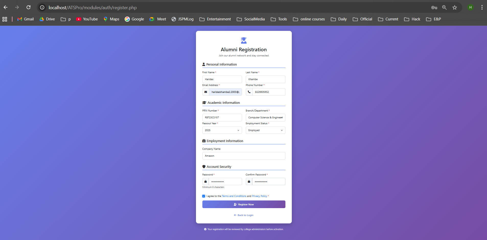
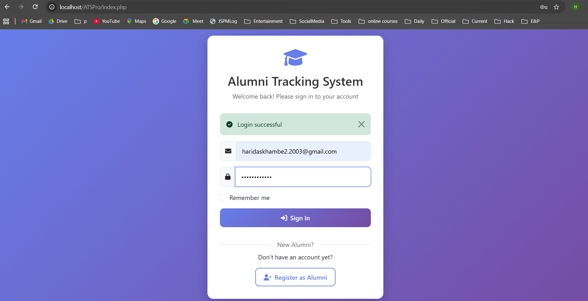
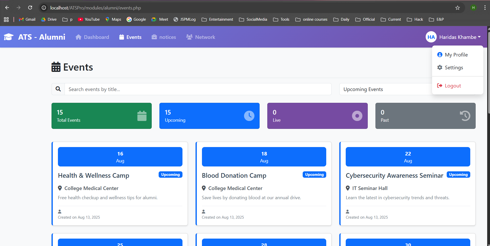
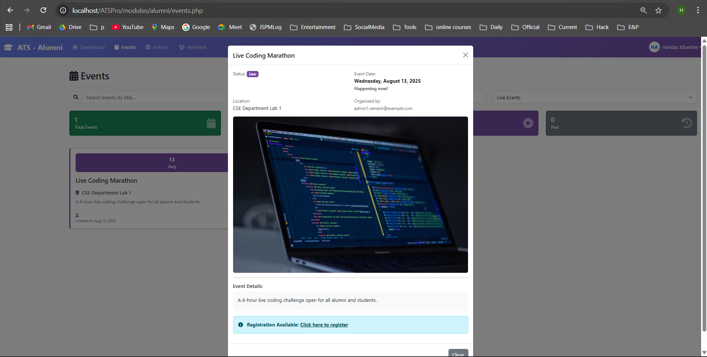
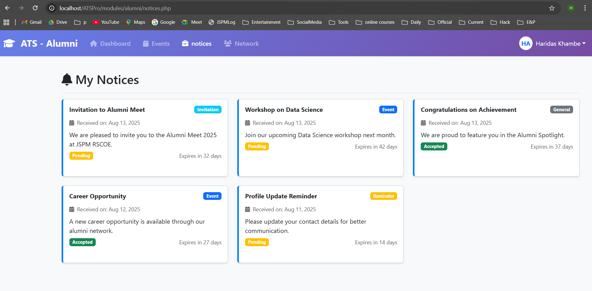
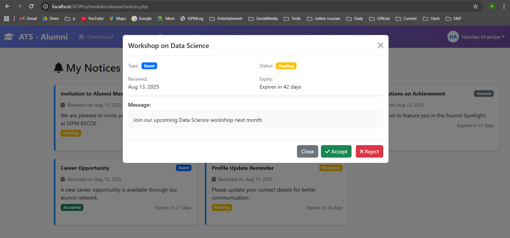
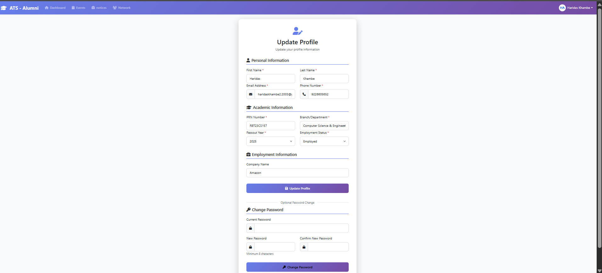

---

### 2️⃣ Admin
- **Login**
- Manage **Alumni** (view, search, filter)
- Manage **Notices** (CRUD + status updates)
- Manage **Events** (CRUD)
- **Verify Alumni** requests

**UI Preview:**
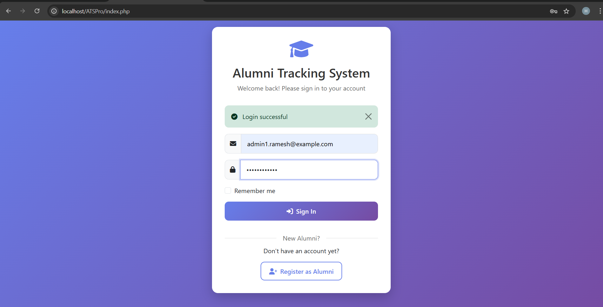
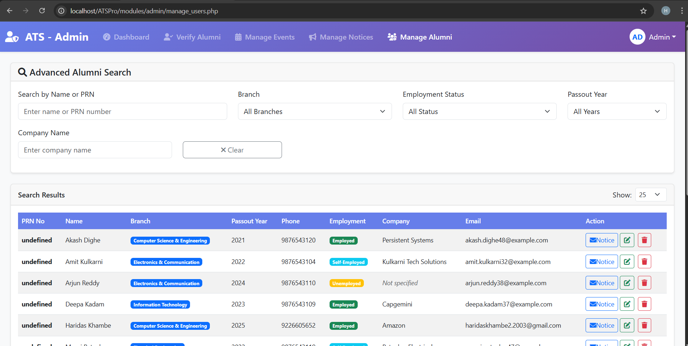
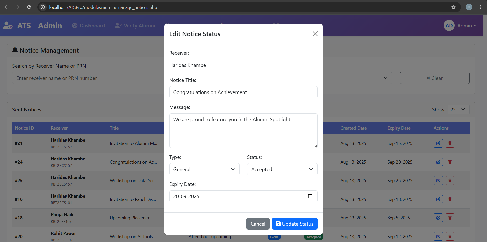
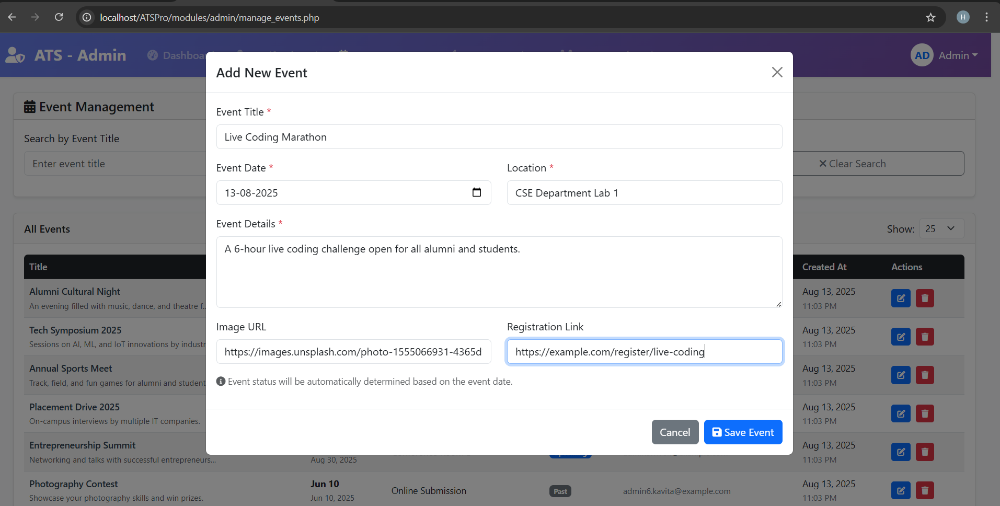
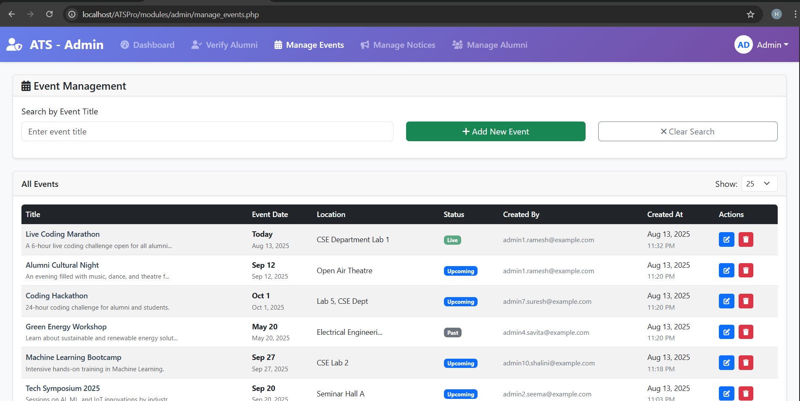
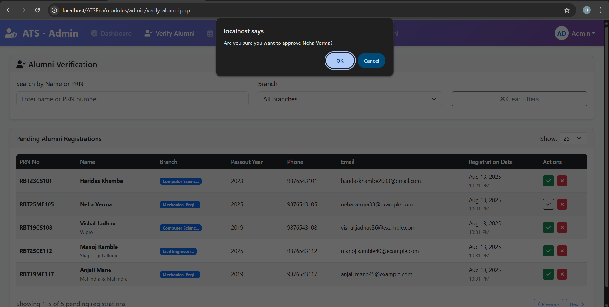

---

### 3️⃣ Directorate
- **Login**
- Manage **Admins** (create/update/delete)
- Manage **Alumni** (advanced filters, search)

**UI Preview:**

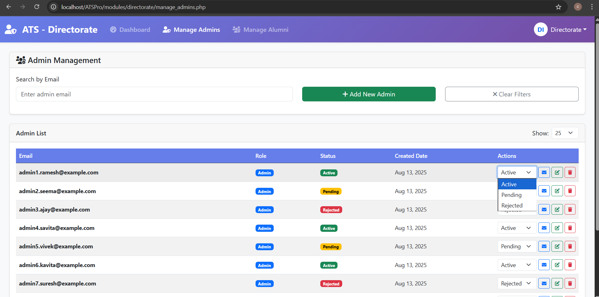
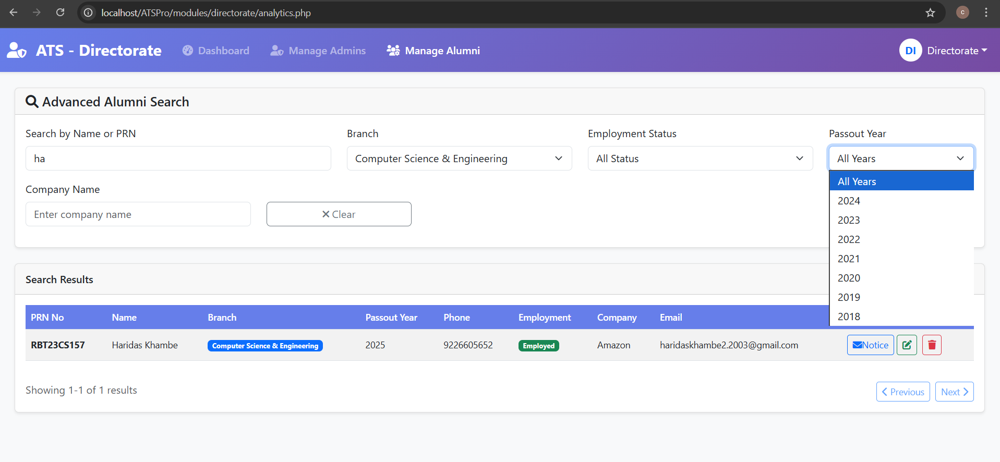

---
**Other Responsive UI:**
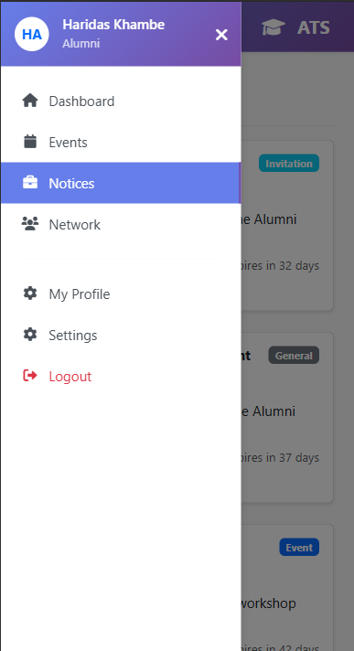

---

## 🔗 API Endpoints Overview
- `api/auth.php` – Login, Register (Alumni only), Logout
- `api/alumni_search.php` – Advanced alumni search & filters
- `api/notices.php` – Fetch alumni notices
- `api/notice_manager.php` – Notice CRUD for Admin
- `api/alumni_events.php` – Fetch events for alumni
- `api/manage_events.php` – Event CRUD for Admin
- `api/alumni_profile.php` – Update alumni profile
- `api/verify_alumni.php` – Verify alumni (Admin)
---

## 📂 Project Structure

```plaintext
project-root/
├── api/                # Backend API Endpoints (REST)
├── assets/             # Static assets (images, JS scripts)
│   └── js/             # Frontend JS logic
├── config/             # Database & Auth Configurations
├── modules/            # Role-specific PHP modules
│   ├── admin/
│   ├── alumni/
│   ├── auth/
│   └── directorate/
├── templates/          # Reusable UI Components
└── index.php           # Unified Login Entry Point
```

## 🛠 Tech Stack

### **Frontend**
- **HTML5** – Structure & semantic layout
- **CSS3** – Styling & responsive UI
- **JavaScript (Vanilla)** – Interactivity & form validation
- **AJAX** – Asynchronous data loading

### **Backend**
- **PHP (Core)** – Server-side logic & role-based authentication
- **REST API Architecture** – Modular API endpoints with JSON responses

### **Database**
- **MySQL** – Relational database with indexed search & foreign key constraints

### **Authentication & Authorization**
- **PHP Sessions** – Secure login state management
- **Role-Based Access Control (RBAC)** – Automatic role detection & dashboard redirection

---

## 📊 Database Schema
Tables:
1. **users** – stores credentials & roles
2. **alumni** – alumni-specific details
3. **events** – system-wide events
4. **notices** – targeted notices with status

**Relationships:**
- `users.id` → `alumni.user_id`
- `users.id` → `events.created_by`
- `users.id` → `notices.sender_id`
- `users.id` → `notices.recipient_id`

---

## 🔒 Security Measures
- Session-based authentication with role-based access control.
- Prepared SQL statements to prevent SQL injection.
- Restricted registration for Admin & Directorate roles.

## ⚡ Optimizations
- MySQL indexing on frequently searched columns (PRN, name, branch, status).
- REST API with lightweight JSON responses.
- Reusable modular JS for filters and CRUD.
---

## 🚀 Future Enhancements
- Email/SMS notifications for events & notices.
- Export alumni data to Excel/CSV.
- Advanced analytics dashboard for Directorate.
- Profile photo uploads for alumni.
---


## 📌 Real-World Applications
- Improves alumni engagement & networking
- Reduces manual tracking time by 40% (advanced filters)
- Centralized event & notice management
- Targeted communication between admins and alumni

---

## 🤝 Contributing

Contributions, issues, and feature requests are welcome!  
Feel free to fork this repository and submit a pull request.
---

## 📬 Contact

**Project Maintainer:** [Haridas Khambe]  
📧 Email: yourname@example.com  
💼 LinkedIn: [linkedin.com/in/yourprofile](https://www.linkedin.com/in/haridas-khambe-aa650926b/)  
🌐 Portfolio:   

---

⭐ If you found this project helpful, please give it a star on GitHub!

---
## 📷 Output Folder
All screenshots are stored in `OUTPUT/` organized by role:
