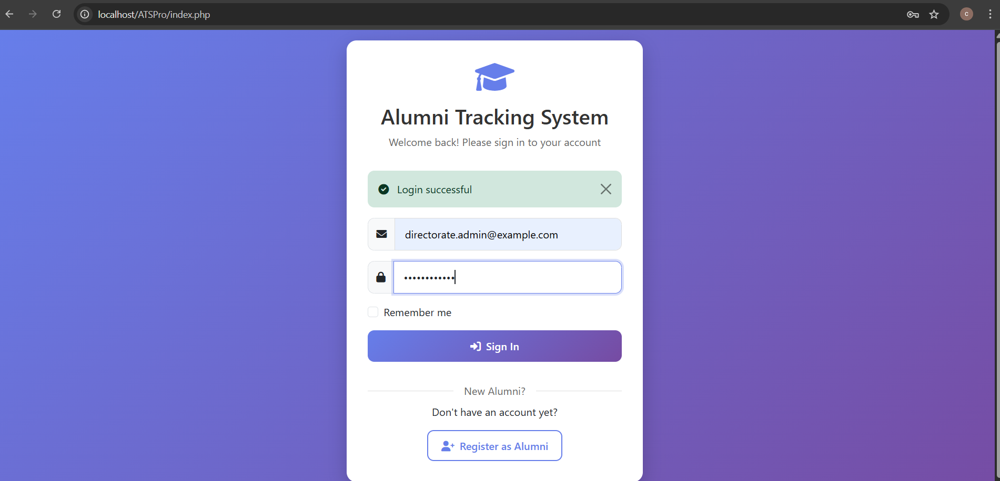

# Alumni Management Platform

A **responsive web-based Alumni Management System** designed to streamline alumni data management, event sharing, and targeted notices.  
This system supports **multi-role access**: **Alumni**, **Admin**, and **Directorate** — each with tailored features and access permissions.  

Built with a **single login page** that detects the user’s role automatically. Only Alumni can self-register; Admin accounts are created by Directorate.

---

## 🚀 Key Features
- Multi-role access: **Alumni**, **Admin**, **Directorate**
- Advanced alumni search & filters (by name, PRN, branch, year, employment status, company)
- Event management (create, update, delete)
- Notices with acceptance/rejection tracking
- REST API backend with secure authentication
- Role-based access control
- Optimized database with **indexes** for faster queries

---

## 🛠 Tech Stack
**Frontend:**
- HTML5, CSS3, JavaScript (Bootstrap for UI)
- Font Awesome icons

**Backend:**
- PHP (REST API-based structure)
- MySQL (with indexing and foreign keys)

**Authentication:**
- Session-based login system
- Role auto-detection

---

## 📂 Role-wise Features

### 1️⃣ Alumni
- **Register**
- **Login**
- View **Events**
- Accept / Reject **Notices**
- Update **Profile**

**UI Preview:**

---

### 2️⃣ Admin
- **Login**
- Manage **Alumni** (view, search, filter)
- Manage **Notices** (CRUD + status updates)
- Manage **Events** (CRUD)
- **Verify Alumni** requests

**UI Preview:**

---

### 3️⃣ Directorate
- **Login**
- Manage **Admins** (create/update/delete)
- Manage **Alumni** (advanced filters, search)

**UI Preview:**

---

## 🔗 API Endpoints Overview
- `api/auth.php` – Login, Register (Alumni only), Logout
- `api/alumni_search.php` – Advanced alumni search & filters
- `api/notices.php` – Fetch alumni notices
- `api/notice_manager.php` – Notice CRUD for Admin
- `api/alumni_events.php` – Fetch events for alumni
- `api/manage_events.php` – Event CRUD for Admin
- `api/alumni_profile.php` – Update alumni profile
- `api/verify_alumni.php` – Verify alumni (Admin)

---

## 📊 Database Schema
Tables:
1. **users** – stores credentials & roles
2. **alumni** – alumni-specific details
3. **events** – system-wide events
4. **notices** – targeted notices with status

**Relationships:**
- `users.id` → `alumni.user_id`
- `users.id` → `events.created_by`
- `users.id` → `notices.sender_id`
- `users.id` → `notices.recipient_id`

---

## 🔒 Security Measures
- Session-based authentication with role-based access control.
- Prepared SQL statements to prevent SQL injection.
- Restricted registration for Admin & Directorate roles.

## ⚡ Optimizations
- MySQL indexing on frequently searched columns (PRN, name, branch, status).
- REST API with lightweight JSON responses.
- Reusable modular JS for filters and CRUD.
---

## 🚀 Future Enhancements
- Email/SMS notifications for events & notices.
- Export alumni data to Excel/CSV.
- Advanced analytics dashboard for Directorate.
- Profile photo uploads for alumni.
---

## 📌 Real-World Applications
- Improves alumni engagement & networking
- Reduces manual tracking time by 40% (advanced filters)
- Centralized event & notice management
- Targeted communication between admins and alumni

---

## 🤝 Contributing

Contributions, issues, and feature requests are welcome!  
Feel free to fork this repository and submit a pull request.
---

## 📬 Contact

**Project Maintainer:** [Your Name]  
📧 Email: yourname@example.com  
💼 LinkedIn: [linkedin.com/in/yourprofile](https://www.linkedin.com/in/haridas-khambe-aa650926b/)  
🌐 Portfolio: [yourwebsite.com](hhttps://github.com/HaridasKhambe)  

---

⭐ If you found this project helpful, please give it a star on GitHub!

---
## 📷 Output Folder
All screenshots are stored in `OUTPUT/` organized by role:
